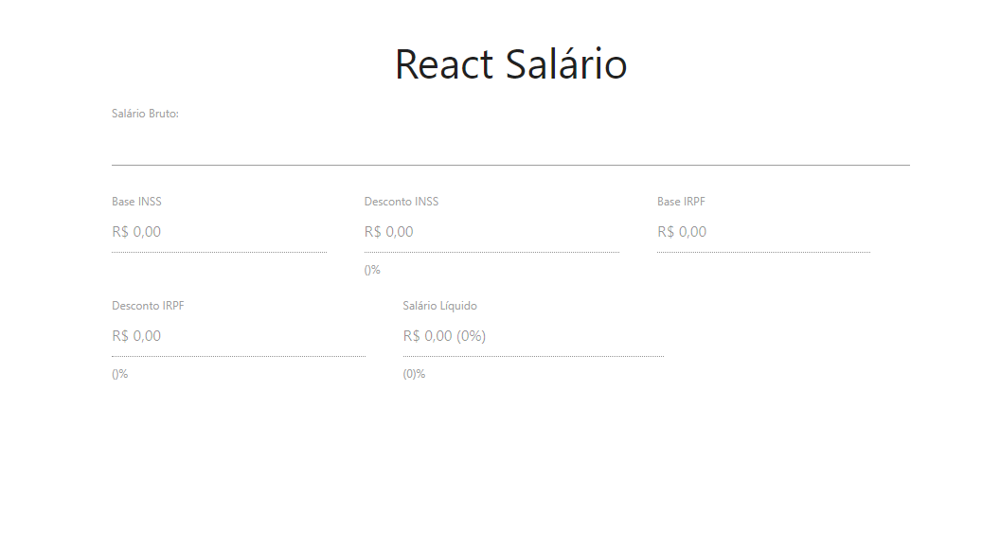
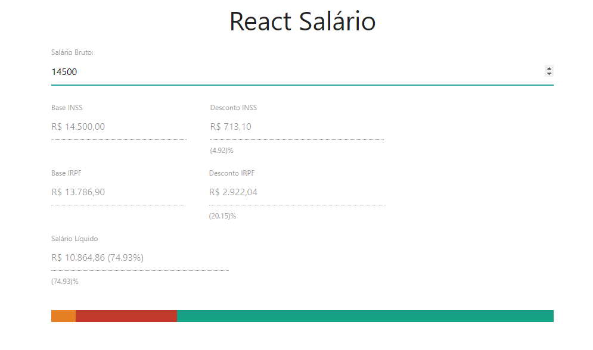

# REACT SALÁRIO

Projeto Desenvolvido no Módulo 03 do Bootcamp Desenvolvedor Full Stack IGTI.
  

Tem por objetivo construir uma aplicação, utilizando React**, para calcular o salário líquido a partir do salário bruto, considerando as regras da CLT de 2020.
  

## Início da aplicação 

## Aplicação com alguns dados

## Funcionamento da aplicação
